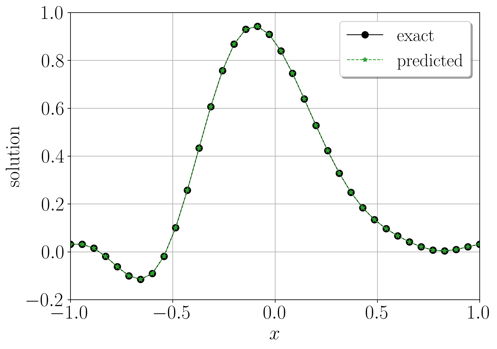
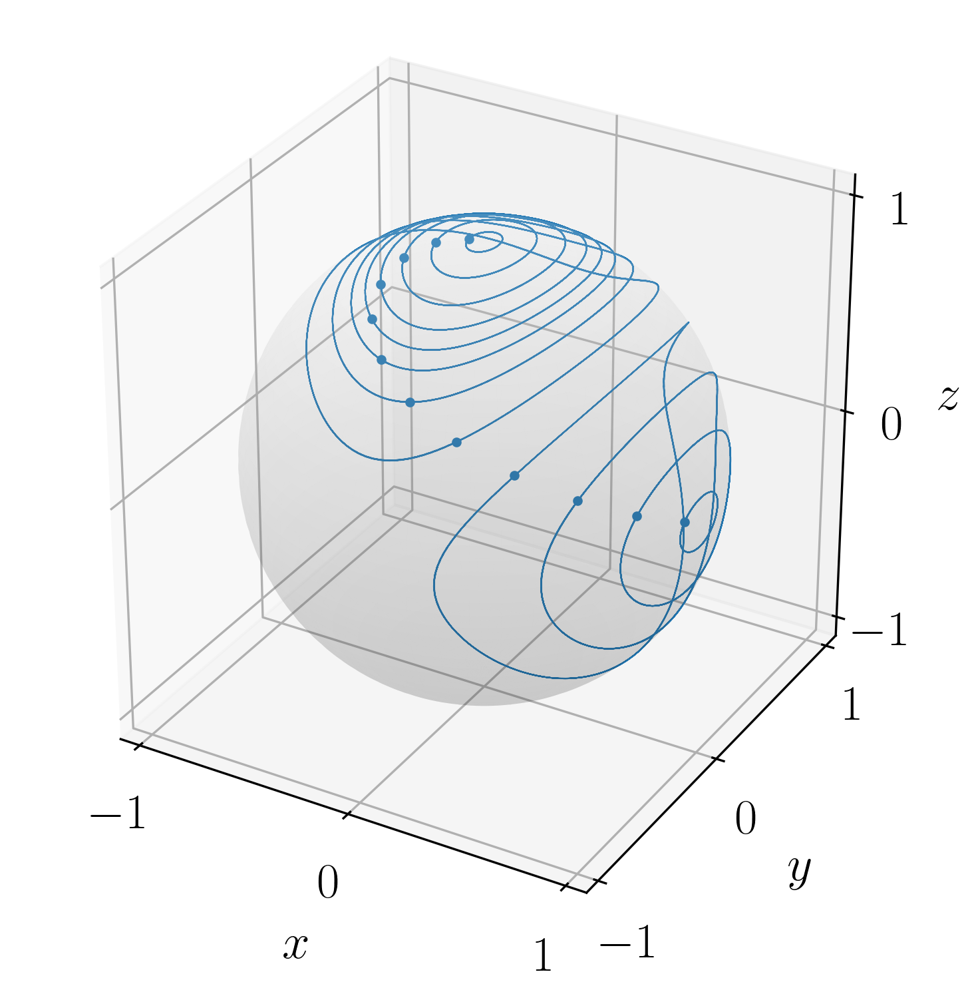
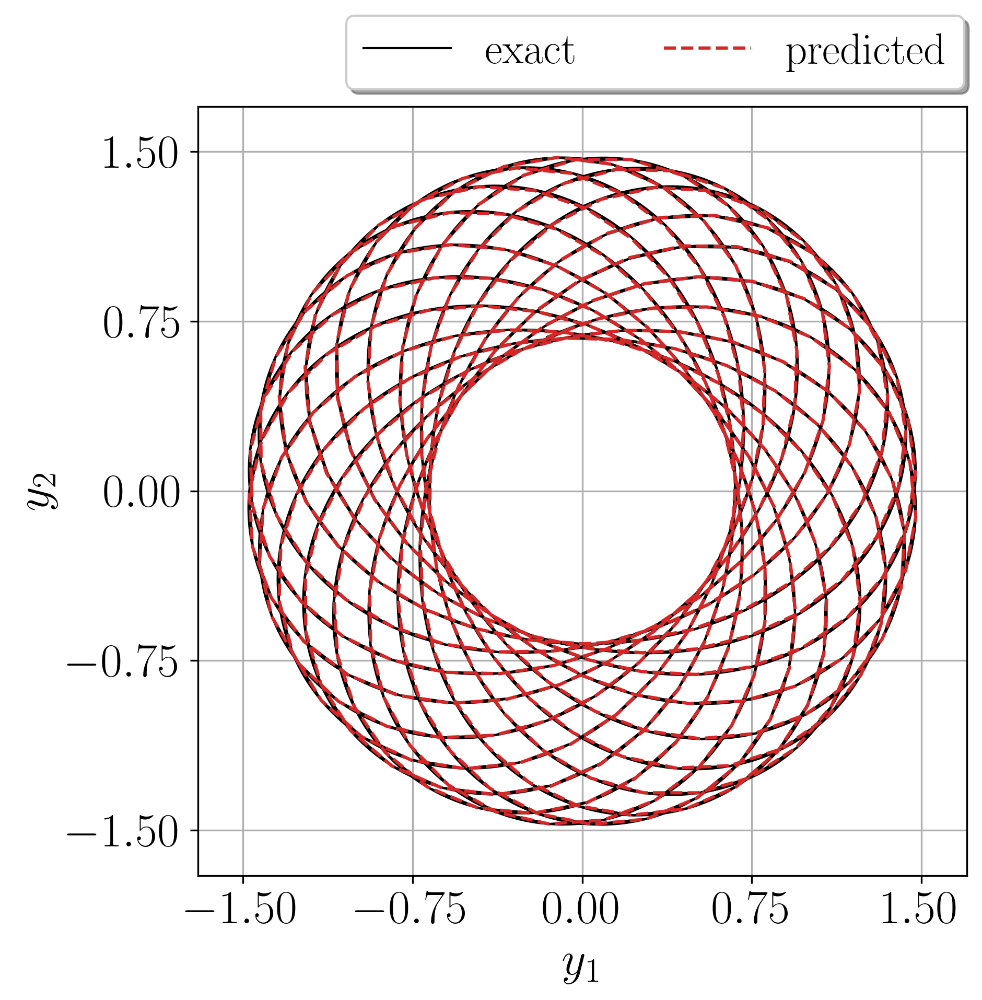

# LocSympNets
PyTorch code for training locally-symplectic neural networks LocSympNets, and symmetric version SymLocSympNets, for learning phase volume-preserving linear and nonlinear dynamics. Using the code, please cite: Jānis Bajārs, *Locally-symplectic neural networks for learning volume-preserving dynamics*, Journal of Computational Physics **476**:111911, 2023 ([DOI: 10.1016/j.jcp.2023.111911](https://www.sciencedirect.com/science/article/pii/S0021999123000062?via%3Dihub)).

File LocSympNets_PureCode_WithoutData.zip contains pure code without precomputed training data, images and pretrained neural networks.

  
   
   

Numerical code has been built on Anaconda open-source Python distribution platform using Spyder IDE. Code contains script files for training adn predicting phase volume-preserving dynamics with LocSympNets and SymLocSympNets, considering three examples: learning linear traveling wave solutions to the semi-discretized advetion equation, periodic trajectories of the Euler equations of the motion of a free rigid body, and quasi-periodic solutions of the charged particle motion in an electromagnetic field. Rigid body examples contains two cases: learning a single periodic trajectory and the whole dynamics from randomly sampled training data.

#### Technical instructions
- Volume-preserving differential equations are coded in file `DynamicalSystems/VolumePreservingODEs.py`.
- Training and testing data is computed in the following files: `DynamicalSystems/TrainingData_AdvectionEq.py`, `DynamicalSystems/TrainingData_RigidBody_Single.py`, `DynamicalSystems/TrainingData_RigidBody_Whole.py`, and `DynamicalSystems/TrainingData_ChargedParticle.py`.
- All training and testing data is saved in associated problem folders `DynamicalSystems/SavedTrainingData/...`.
- All neural network functionas are defined in folder `NeuralNetworkFnc`.
- File `NeuralNetworkFnc/module-class.py` contains all LocSympNets and SymLocSympNets modules.
- File `NeuralNetworkFnc/training-class.py` contains neural network training functions.
- Additional neural network supporting functions are defined in files `NeuralNetworkFnc/mySequential.py` and `NeuralNetworkFnc/custom_dataset.py`.
- Training script files with LocSympNets for four example cases are: `training_AdvectionEq_script.py`, `training_RigidBody_Single_script.py`, `training_RigidBody_Whole_script.py`, and `training_ChargedParticle_script.py`, respectively. 
