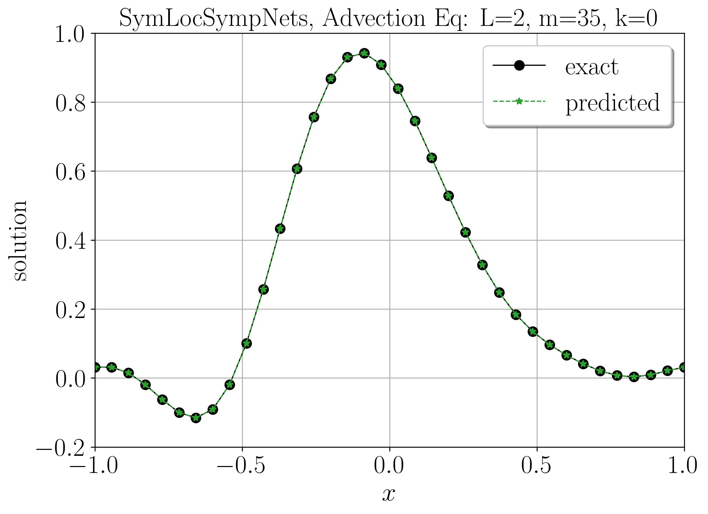

# LocSympNets
PyTorch code for training locally-symplectic neural networks LocSympNets, and symmetric version SymLocSympNets, for learning phase volume-preserving linear and nonlinear dynamics. Using the code, please cite: Jānis Bajārs, *Locally-symplectic neural networks for learning volume-preserving dynamics*, Journal of Computational Physics **476**:111911, 2023 ([DOI: 10.1016/j.jcp.2023.111911](https://www.sciencedirect.com/science/article/pii/S0021999123000062?via%3Dihub)).

File LocSympNets_PureCode_WithoutData.zip contains pure code without precomputed training data, images and pretrained neural networks.

  
   
   

### Technical instructions

 

